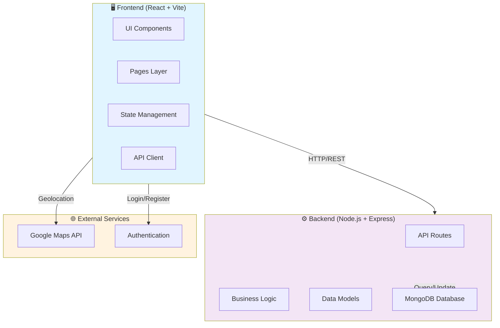
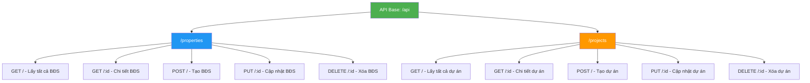
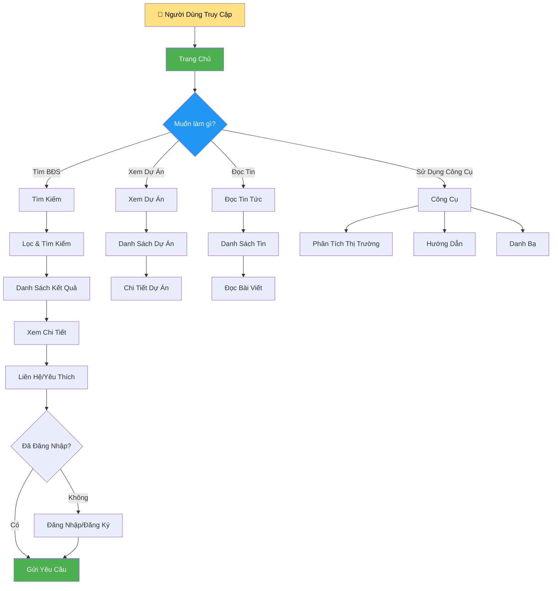

# Sơ Đồ Website Bất Động Sản

## 1. Kiến Trúc Hệ Thống Tổng Quan



## 2. Cấu Trúc Trang (Sitemap)

```mermaid
graph TD
    Home["🏠 Trang Chủ"]
    
    Home --> Properties["🏢 Bất Động Sản"]
    Home --> Projects["🏗️ Dự Án"]
    Home --> News["📰 Tin Tức"]
    Home --> Tools["🛠️ Công Cụ"]
    Home --> Info["ℹ️ Thông Tin"]
    Home --> Auth["👤 Tài Khoản"]
    
    Properties --> PropList["Danh Sách BĐS"]
    Properties --> ForSale["Bán"]
    Properties --> ForRent["Cho Thuê"]
    Properties --> PropDetail["Chi Tiết BĐS"]
    
    Projects --> ProjList["Danh Sách Dự Án"]
    Projects --> ProjDetail["Chi Tiết Dự Án"]
    
    News --> NewsList["Danh Sách Tin"]
    
    Tools --> Analysis["Phân Tích"]
    Tools --> Wiki["Wiki/Hướng Dẫn"]
    Tools --> Directory["Danh Bạ"]
    
    Info --> About["Về Chúng Tôi"]
    Info --> Contact["Liên Hệ"]
    
    Auth --> Login["Đăng Nhập"]
    Auth --> Register["Đăng Ký"]
    
    style Home fill:#4CAF50,color:#fff
    style Properties fill:#2196F3,color:#fff
    style Projects fill:#FF9800,color:#fff
    style News fill:#9C27B0,color:#fff
    style Tools fill:#00BCD4,color:#fff
    style Info fill:#795548,color:#fff
    style Auth fill:#F44336,color:#fff
```



## 3. Luồng Dữ Liệu (Data Flow)

```mermaid
graph LR
    User["👤 User"]
    UI["UI/Components"]
    State["State<br/>Management"]
    API["API Layer"]
    Server["Express<br/>Server"]
    Models["MongoDB<br/>Models"]
    DB["Database"]
    
    User -->|Interact| UI
    UI -->|Update| State
    State -->|Fetch/Post| API
    API -->|HTTP Request| Server
    Server -->|Query| Models
    Models -->|CRUD| DB
    DB -->|Response| Models
    Models -->|Data| Server
    Server -->|JSON| API
    API -->|Update| State
    State -->|Render| UI
    UI -->|Display| User
    
    style User fill:#FFE082
    style UI fill:#81C784
    style State fill:#64B5F6
    style API fill:#BA68C8
    style Server fill:#FF8A65
    style Models fill:#4DD0E1
    style DB fill:#A1887F
```



## 4. Cấu Trúc Thư Mục Frontend

```
client/
├── src/
│   ├── components/          # Reusable Components
│   │   ├── Header.jsx       # Navigation Header
│   │   ├── Footer.jsx       # Footer
│   │   ├── PropertyCard.jsx # Property Card Component
│   │   └── MapView.jsx      # Map Component
│   │
│   ├── pages/               # Page Components
│   │   ├── Home.jsx         # Homepage
│   │   ├── PropertyList.jsx # Property Listing
│   │   ├── PropertyDetail.jsx
│   │   ├── ForSale.jsx      # For Sale Properties
│   │   ├── ForRent.jsx      # For Rent Properties
│   │   ├── Projects.jsx     # Projects Listing
│   │   ├── ProjectDetail.jsx
│   │   ├── News.jsx         # News Page
│   │   ├── Wiki.jsx         # Wiki/Guide
│   │   ├── Analysis.jsx     # Analysis Tools
│   │   ├── Directory.jsx    # Directory
│   │   ├── Login.jsx        # Login Page
│   │   └── Register.jsx     # Register Page
│   │
│   ├── App.jsx              # Main App Component
│   └── main.jsx             # Entry Point
│
└── public/                  # Static Assets
    └── images/              # Images
```

## 5. Cấu Trúc Thư Mục Backend

```
server/
├── config/
│   └── database.js          # MongoDB Connection
│
├── models/                  # Data Models
│   ├── Property.js          # Property Model
│   └── Project.js           # Project Model
│
├── routes/                  # API Routes
│   ├── properties.js        # Property Endpoints
│   └── projects.js          # Project Endpoints
│
├── data/                    # Sample Data
│   ├── properties.js
│   ├── projects.js
│   └── detailedProperties.js
│
├── scripts/                 # Utility Scripts
│   ├── seedData.js          # Seed Database
│   └── addMasterPlans.js
│
├── index.js                 # Server Entry Point
└── .env                     # Environment Variables
```

## 6. API Endpoints



## 7. Mô Hình Dữ Liệu (Data Models)

### Property Model
```javascript
{
  _id: ObjectId,
  title: String,              // Tiêu đề BĐS
  description: String,        // Mô tả
  price: Number,              // Giá
  pricePerUnit: Number,       // Giá/m²
  type: String,               // Loại: Nhà, Căn hộ, Đất, etc
  status: String,             // Bán/Cho thuê
  location: {
    address: String,
    district: String,
    city: String,
    coordinates: {
      lat: Number,
      lng: Number
    }
  },
  details: {
    area: Number,             // Diện tích
    bedrooms: Number,
    bathrooms: Number,
    floors: Number
  },
  images: [String],           // URLs hình ảnh
  amenities: [String],        // Tiện ích
  createdAt: Date,
  updatedAt: Date
}
```

### Project Model
```javascript
{
  _id: ObjectId,
  name: String,               // Tên dự án
  description: String,
  developer: String,          // Chủ đầu tư
  location: {
    address: String,
    district: String,
    city: String,
    coordinates: {
      lat: Number,
      lng: Number
    }
  },
  details: {
    totalArea: Number,        // Tổng diện tích
    totalUnits: Number,       // Tổng số căn
    floors: Number,
    startDate: Date,
    completionDate: Date
  },
  images: [String],
  amenities: [String],
  masterPlan: String,         // URL sơ đồ tổng thể
  createdAt: Date,
  updatedAt: Date
}
```

## 8. Luồng Người Dùng (User Flow)



## 9. Công Nghệ Stack

| Layer | Công Nghệ | Mục Đích |
|-------|-----------|---------|
| **Frontend** | React 18 | UI Framework |
| | Vite | Build Tool |
| | React Router | Navigation |
| | CSS3 | Styling |
| **Backend** | Node.js | Runtime |
| | Express.js | Web Framework |
| | MongoDB | Database |
| | Mongoose | ODM |
| **DevOps** | Docker | Containerization |
| | Docker Compose | Orchestration |
| **External** | Google Maps | Mapping |

## 10. Tính Năng Chính

### 🏠 Trang Chủ
- Banner quảng cáo
- BĐS nổi bật
- Dự án mới
- Tin tức mới nhất
- Thống kê thị trường

### 🏢 Bất Động Sản
- Danh sách BĐS với bộ lọc
- Tìm kiếm nâng cao
- Xem chi tiết BĐS
- Bản đồ tương tác
- So sánh BĐS

### 🏗️ Dự Án
- Danh sách dự án
- Chi tiết dự án
- Sơ đồ tổng thể
- Tiến độ xây dựng
- Thông tin chủ đầu tư

### 📰 Tin Tức
- Danh sách bài viết
- Tin tức thị trường
- Hướng dẫn mua bán
- Phân tích xu hướng

### 🛠️ Công Cụ
- Phân tích thị trường
- Wiki/Hướng dẫn
- Danh bạ môi giới
- Tính toán lãi suất
- Tính chi phí xây dựng

### 👤 Tài Khoản
- Đăng nhập/Đăng ký
- Quản lý yêu thích
- Lịch sử tìm kiếm
- Thông báo

## 11. Quy Trình Triển Khai


---

**Tạo bởi**: Kiro AI Assistant  
**Ngày**: 2025-11-23  
**Phiên bản**: 1.0
